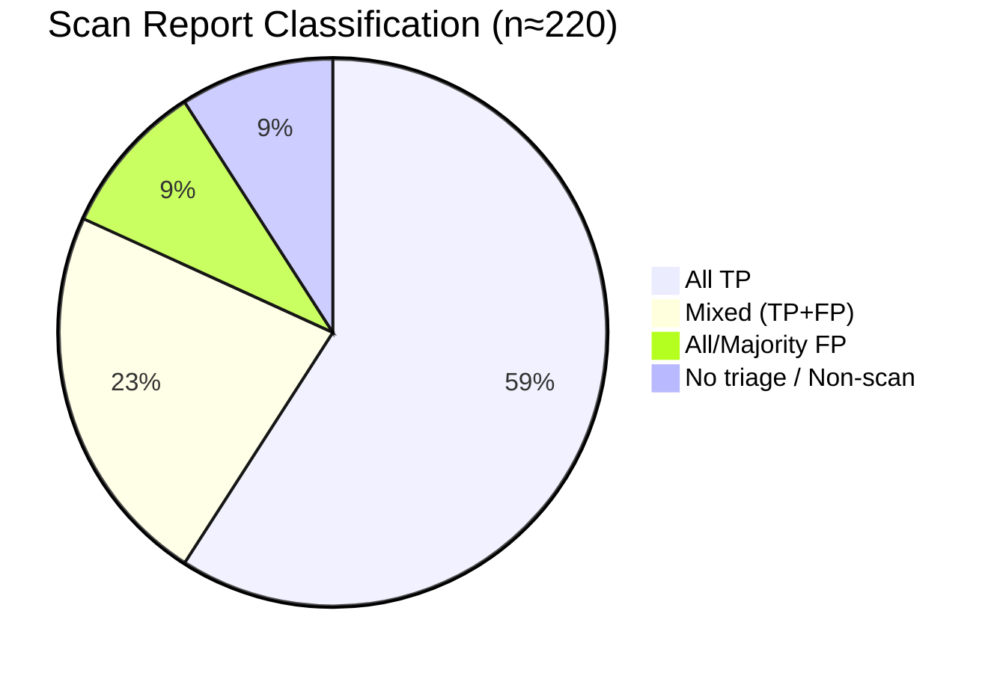
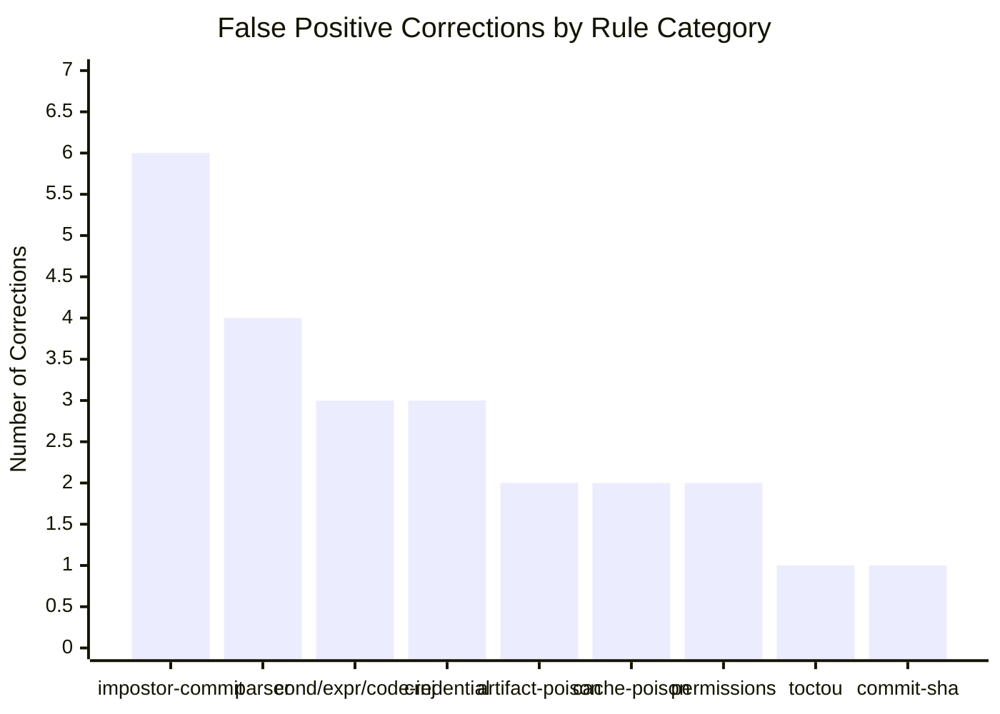
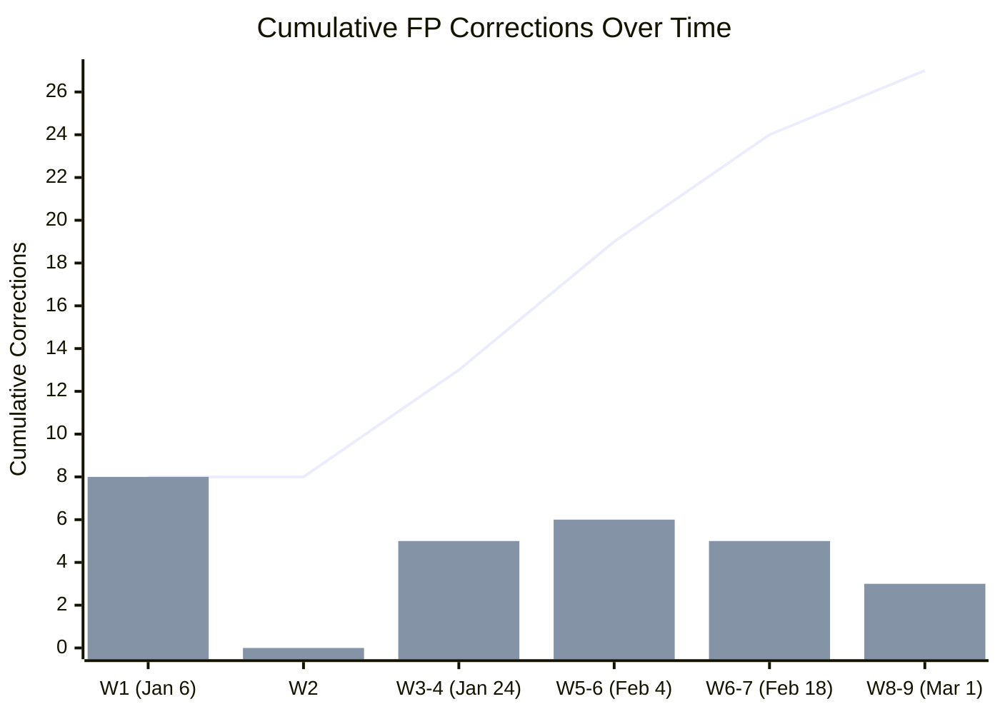
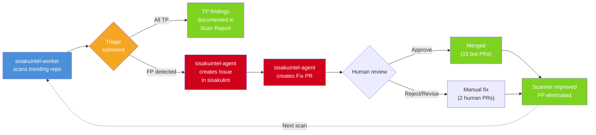
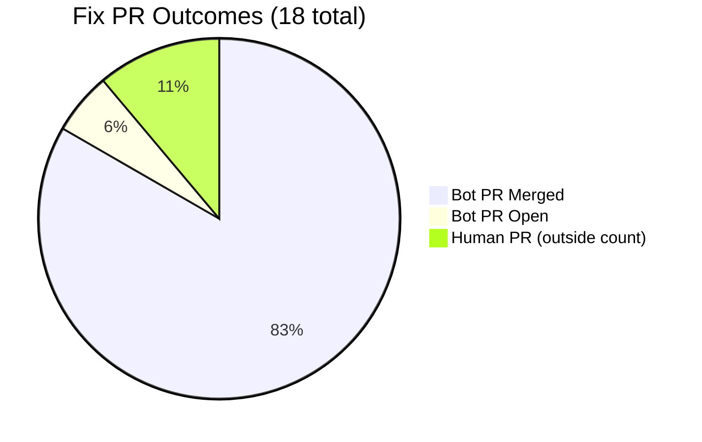

# Self-Healing Triage Dataset

Complete audit of all triage decisions made by the sisakuintel-agent self-healing system, published for independent verification and community challenge.

> Data Sources
> - [sisakulint Issues/PRs by sisakuintel-agent](https://github.com/sisaku-security/sisakulint/issues?q=author%3Aapp%2Fsisakuintel-agent) — False positive reports and fix PRs (45 items)
> - [sisakuintel-worker Scan Reports](https://github.com/sisaku-security/sisakuintel-worker/issues) — Full triage results including true positives (~220 reports, #300–#555)
>
> Last Updated: 2026-03-06

---

## How to Read This Dataset

The self-healing architecture routes findings through two repositories:

1. sisakuintel-worker: The scan-orchestrator creates [Scan Report] issues for each scanned repository. A triage comment classifies every finding as TP or FP with reasoning.
2. sisakulint: When the triage agent identifies a false positive, it creates a bug report Issue and a corresponding fix PR in the scanner's own repository. Only FP-related items appear here.

The "45 triaged items" referenced in the evaluation metrics counts 27 Finding Issues + 18 Fix PRs created by sisakuintel-agent[bot] in the sisakulint repository. TP findings are documented in sisakuintel-worker Scan Report comments.

---

## Classification Criteria

A finding is classified as:

- True Positive (TP): The flagged pattern is exploitable given the workflow's trigger type, permission scope, and step dependency graph.
- False Positive (FP): Any contextual factor (trigger restrictions, permission scope, step dependencies, safe data types) eliminates exploitability.

Ground truth was determined by the author (Atsushi Sada). This dataset publishes the complete classification with per-finding rationale to enable independent re-classification by any reviewer.

---

## Part A: sisakulint Repository — FP Reports + Fix PRs (45 Items)

### Legend

| Symbol | Meaning |
|--------|---------|
| FP | False Positive |
| Bug | Scanner bug (not a TP/FP classification) |
| Merged | Fix PR merged after human review |
| Open | Fix PR pending |
| N/A | No bot-generated fix PR |

### Week 1 (2026-01-06 – 2026-01-11) — 12 items

| # | Issue/PR | Type | Classification | Rule | Target Repo | Rationale |
|---|---------|------|----------------|------|-------------|-----------|
| 1 | [#234](https://github.com/sisaku-security/sisakulint/issues/234) | Issue | FP | syntax (parser) | anthropics/claude-code | `description` is a valid workflow key. Missing from allowed keys list in parse_main.go |
| 2 | [#235](https://github.com/sisaku-security/sisakulint/pull/235) | PR (HikaruEgashira) | Fix → Merged | syntax | — | Fix for #234 |
| 3 | [#240](https://github.com/sisaku-security/sisakulint/issues/240) | Issue | FP | cache-poisoning | — | Checking out `base.ref` (target branch) is safe; does not execute PR code |
| 4 | [#241](https://github.com/sisaku-security/sisakulint/pull/241) | PR | Fix → Merged | cache-poisoning | — | Fix for #240 |
| 5 | [#242](https://github.com/sisaku-security/sisakulint/issues/242) | Issue | FP (2 findings) | cond, expression | ophub/fnnas | (a) Multi-expression conditions `${{ A }} == ${{ B }}` flagged as "always true"; (b) `cancelled()` treated as undefined function |
| 6 | [#245](https://github.com/sisaku-security/sisakulint/issues/245) | Issue | FP | cond | — | Same root cause as #242 |
| 7 | [#246](https://github.com/sisaku-security/sisakulint/issues/246) | Issue | Bug | cond, expression | — | Auto-fix functionality broken for these rules |
| 8 | [#247](https://github.com/sisaku-security/sisakulint/pull/247) | PR | Fix → Merged | cond | — | Fix for #242/#245/#246 |
| 9 | [#249](https://github.com/sisaku-security/sisakulint/issues/249) | Issue | FP | permissions | — | `permissions: read-all` is valid (used by OpenSSF Scorecard). Missing from switch statement |
| 10 | [#250](https://github.com/sisaku-security/sisakulint/pull/250) | PR | Fix → Merged | permissions | — | Fix for #249 |
| 11 | [#251](https://github.com/sisaku-security/sisakulint/issues/251) | Issue | FP | artifact-poisoning | — | `/tmp` is outside workspace; cannot overwrite source code |
| 12 | [#252](https://github.com/sisaku-security/sisakulint/pull/252) | PR | Fix → Merged | artifact-poisoning | — | Fix for #251 |

### Week 3–4 (2026-01-24 – 2026-02-01) — 6 items

| # | Issue/PR | Type | Classification | Rule | Target Repo | Rationale |
|---|---------|------|----------------|------|-------------|-----------|
| 13 | [#307](https://github.com/sisaku-security/sisakulint/issues/307) | Issue | FP | impostor-commit | github/copilot-sdk | Valid commit on `releases/v5` branch flagged as impostor |
| 14 | [#308](https://github.com/sisaku-security/sisakulint/issues/308) | Issue | FP (3 findings) | untrusted-checkout, cache-poisoning, code-injection | google/langextract | Job-level `if: github.event_name == 'pull_request'` restricts execution to safe triggers, but rules only check workflow-level triggers |
| 15 | [#309](https://github.com/sisaku-security/sisakulint/issues/309) | Issue | FP (2 findings) | permissions, impostor-commit | nexmoe/VidBee | (a) Job-level permissions defined but workflow-level flagged as missing; (b) valid main branch commit flagged as impostor |
| 16 | [#310](https://github.com/sisaku-security/sisakulint/issues/310) | Issue | FP | artifact-poisoning | OpenBMB/VoxCPM | No checkout step in job — artifact download cannot overwrite source code |
| 17 | [#311](https://github.com/sisaku-security/sisakulint/pull/311) | PR | Fix → Merged | permissions | — | Fix for #309 |
| 18 | [#312](https://github.com/sisaku-security/sisakulint/pull/312) | PR | Fix → Merged | artifact-poisoning | — | Fix for #310 |

*Note: #308 was fixed by [#315](https://github.com/sisaku-security/sisakulint/pull/315) (by ultra-supara, introducing `JobTriggerAnalyzer`). Not a bot PR, not counted in 45.*

### Week 5–6 (2026-02-04 – 2026-02-17) — 10 items

| # | Issue/PR | Type | Classification | Rule | Target Repo | Rationale |
|---|---------|------|----------------|------|-------------|-----------|
| 19 | [#324](https://github.com/sisaku-security/sisakulint/issues/324) | Issue | FP | impostor-commit | j178/prek | Annotated tag object SHA differs from commit SHA; valid commit flagged |
| 20 | [#328](https://github.com/sisaku-security/sisakulint/issues/328) | Issue | FP | artipacked | — | Auto-fix unconditionally adds `persist-credentials: false`, breaking workflows that need git credentials for `git push` |
| 21 | [#329](https://github.com/sisaku-security/sisakulint/pull/329) | PR | Fix → Merged | artipacked | — | Fix for #328: guard condition checking for upload-artifact |
| 22 | [#333](https://github.com/sisaku-security/sisakulint/issues/333) | Issue | FP (2 findings) | impostor-commit, cache-poisoning | koala73/worldmonitor | (a) Annotated tag handling; (b) `swatinem/rust-cache` false alert |
| 23 | [#334](https://github.com/sisaku-security/sisakulint/pull/334) | PR | Fix → Merged | impostor-commit, cache-poisoning | — | Fix for #324/#333 |
| 24 | [#335](https://github.com/sisaku-security/sisakulint/issues/335) | Issue | FP | parser | nearai/ironclaw | YAML anchors (`&name`) and aliases (`*name`) flagged as syntax errors |
| 25 | [#336](https://github.com/sisaku-security/sisakulint/pull/336) | PR | Fix → Merged | parser | — | Fix for #335: added `dereferenceAlias()` helper |
| 26 | [#337](https://github.com/sisaku-security/sisakulint/issues/337) | Issue | FP | parser | — | `dependabot.yml` validated as workflow file, reporting missing `on:`/`jobs:` |
| 27 | [#338](https://github.com/sisaku-security/sisakulint/pull/338) | PR | Fix → Merged | parser | — | Fix for #337 |

### Week 6–7 (2026-02-18 – 2026-02-27) — 10 items

| # | Issue/PR | Type | Classification | Rule | Target Repo | Rationale |
|---|---------|------|----------------|------|-------------|-----------|
| 28 | [#339](https://github.com/sisaku-security/sisakulint/issues/339) | Issue | FP | dependabot-github-actions | — | Remote scan mode uses `os.Stat()` on local filesystem |
| 29 | [#340](https://github.com/sisaku-security/sisakulint/pull/340) | PR | Fix → Merged | dependabot-github-actions | — | Fix for #339 |
| 30 | [#341](https://github.com/sisaku-security/sisakulint/issues/341) | Issue | FP | toctou | google/langextract | `JobTriggerAnalyzer` (PR #315) was not applied to TOCTOU rule variant |
| 31 | [#342](https://github.com/sisaku-security/sisakulint/pull/342) | PR | Fix → Merged | toctou | — | Fix for #341 |
| 32 | [#344](https://github.com/sisaku-security/sisakulint/issues/344) | Issue | FP | parser | — | #338 fix not deployed to API server; dependabot.yml FP recurrence |
| 33 | [#346](https://github.com/sisaku-security/sisakulint/issues/346) | Issue | FP | commit-sha | — | Local actions (`./my-action`) are part of the same repo; not subject to supply chain attacks |
| 34 | [#347](https://github.com/sisaku-security/sisakulint/pull/347) | PR | Fix → Merged | commit-sha | — | Fix for #346 |
| 35 | [#348](https://github.com/sisaku-security/sisakulint/issues/348) | Issue | Bug | infra | — | Lambda deployment outdated |
| 36 | [#349](https://github.com/sisaku-security/sisakulint/issues/349) | Issue | FP | impostor-commit | — | API rate-limiting causes `getTags()` to return empty; all fallback checks fail, falling through to `isImpostor: true` |
| 37 | [#350](https://github.com/sisaku-security/sisakulint/pull/350) | PR | Fix → Merged | impostor-commit | — | Fix for #349: fail-open on API errors |

### Week 8–9 (2026-03-01 – 2026-03-03) — 8 items

| # | Issue/PR | Type | Classification | Rule | Target Repo | Rationale |
|---|---------|------|----------------|------|-------------|-----------|
| 38 | [#370](https://github.com/sisaku-security/sisakulint/issues/370) | Issue | FP | impostor-commit | gsd-build/get-shit-done | Official tagged commits (v4.3.1, v4.4.0) flagged as impostor |
| 39 | [#371](https://github.com/sisaku-security/sisakulint/issues/371) | Issue | FP | code-injection | — | `head.sha` is always 40-char hex; cannot contain shell metacharacters |
| 40 | [#372](https://github.com/sisaku-security/sisakulint/pull/372) | PR | Fix → Merged | code-injection | — | Fix for #371 |
| 41 | [#373](https://github.com/sisaku-security/sisakulint/issues/373) | Issue | FP | impostor-commit | dtolnay/rust-toolchain | Non-default branches (`stable`, `nightly`) used as version identifiers; reachability check only compared against default branch |
| 42 | [#374](https://github.com/sisaku-security/sisakulint/pull/374) | PR | Fix → Merged | impostor-commit | — | Fix for #373 |
| 43 | [#375](https://github.com/sisaku-security/sisakulint/issues/375) | Issue | FP | secret-exfiltration | — | Webhook URL used as curl destination misidentified as data exfiltration |
| 44 | [#376](https://github.com/sisaku-security/sisakulint/pull/376) | PR | Fix → Open | secret-exfiltration | — | Fix for #375 (superseded by #378) |
| 45 | [#377](https://github.com/sisaku-security/sisakulint/issues/377) | Issue | FP (2 findings) | secret-exfiltration | — | (a) Shell line continuation (`\`) breaks `matchesLegitPattern`; (b) secret used as curl URL positional arg misidentified as data payload |
| — | [#378](https://github.com/sisaku-security/sisakulint/pull/378) | PR | Fix → Merged | secret-exfiltration | — | Fix for #375/#377 |

---

## Visualizations

### Scan Report Classification Distribution

### FP Corrections by Rule Category

### Self-Healing Timeline (Cumulative FP Corrections)

*Bar = new FP findings per period. Line = cumulative total.*

### Self-Healing Pipeline Flow

### Fix PR Outcome Distribution

---

## Part B: sisakuintel-worker Repository — Scan Report Triage (TP + FP)

Each [Scan Report] issue in sisakuintel-worker contains a triage comment with per-finding TP/FP classification and reasoning. This section summarizes all triaged reports from #300 to #555.

### Aggregate Classification (#300–#555, ~220 Scan Reports)

| Classification | Count | Percentage |
|----------------|-------|------------|
| All TP (every finding confirmed valid) | ~130 | ~60% |
| Mixed (TP + FP in same report) | ~50 | ~23% |
| All/Majority FP (scanner bug) | ~20 | ~9% |
| No triage comment / Non-scan issues | ~20 | ~8% |

### Representative HIGH/CRITICAL Severity TP Findings

| Worker # | Repository | Detection | Severity |
|----------|-----------|-----------|----------|
| [#513](https://github.com/sisaku-security/sisakuintel-worker/issues/513) | ZhuLinsen/daily_stock_analysis | `pull_request_target` + PR head checkout → external contributor code runs with access to GEMINI_API_KEY, OPENAI_API_KEY, GITHUB_TOKEN | CRITICAL |
| [#542](https://github.com/sisaku-security/sisakuintel-worker/issues/542) | router-for-me/CLIProxyAPI | Additional HIGH severity vulnerability discovered during triage | HIGH |
| [#469](https://github.com/sisaku-security/sisakuintel-worker/issues/469) | Veirt/weathr | `code-injection-critical` in homebrew.yml | HIGH |
| [#484](https://github.com/sisaku-security/sisakuintel-worker/issues/484) | stan-smith/FossFLOW | impostor-commit + dangerous-triggers-critical | HIGH |

### Representative All-TP Scan Reports

| Worker # | Repository | Findings | Key Rules |
|----------|-----------|----------|-----------|
| [#554](https://github.com/sisaku-security/sisakuintel-worker/issues/554) | rtk-ai/rtk | 105 | commit-sha, secrets:inherit, dependabot, latest tag |
| [#553](https://github.com/sisaku-security/sisakuintel-worker/issues/553) | ruvnet/RuView | 280 | permissions, dependabot, commit-sha |
| [#552](https://github.com/sisaku-security/sisakuintel-worker/issues/552) | openai/symphony | 21 | permissions, dependabot, commit-sha |
| [#534](https://github.com/sisaku-security/sisakuintel-worker/issues/534) | superset-sh/superset | 406 | commit-sha, artifact-poisoning, cache-poisoning, artipacked |
| [#527](https://github.com/sisaku-security/sisakuintel-worker/issues/527) | alibaba/OpenSandbox | 316 | commit-sha, artipacked, dependabot, self-hosted-runner |
| [#509](https://github.com/sisaku-security/sisakuintel-worker/issues/509) | ruvnet/ruvector | 1269 | commit-sha, artipacked, permissions |
| [#506](https://github.com/sisaku-security/sisakuintel-worker/issues/506) | clockworklabs/SpacetimeDB | 499 | permissions, dependabot, commit-sha, artipacked |
| [#492](https://github.com/sisaku-security/sisakuintel-worker/issues/492) | D4Vinci/Scrapling | 71 | all TP |
| [#491](https://github.com/sisaku-security/sisakuintel-worker/issues/491) | cloudflare/agents | 29 | all TP |
| [#452](https://github.com/sisaku-security/sisakuintel-worker/issues/452) | anthropics/claude-quickstarts | 68 | all TP |

### Representative Mixed (TP + FP) Scan Reports

Reports where the triage correctly separated TP from FP within the same scan:

| Worker # | Repository | TP Count | FP Count | FP Details | Resulting Fix |
|----------|-----------|----------|----------|------------|---------------|
| [#543](https://github.com/sisaku-security/sisakuintel-worker/issues/543) | mengxi-ream/read-frog | 86 | 2 | `secret-exfiltration` FP | → sisakulint [#378](https://github.com/sisaku-security/sisakulint/pull/378) |
| [#538](https://github.com/sisaku-security/sisakuintel-worker/issues/538) | block/goose | many | many | `impostor-commit` mass FP; `reusable-workflow-taint` TP | → sisakulint [#370](https://github.com/sisaku-security/sisakulint/issues/370) |
| [#531](https://github.com/sisaku-security/sisakuintel-worker/issues/531) | gsd-build/get-shit-done | 5 | 2 | `impostor-commit` on actions/checkout@v4.3.1 | → sisakulint [#370](https://github.com/sisaku-security/sisakulint/issues/370) |
| [#536](https://github.com/sisaku-security/sisakuintel-worker/issues/536) | koala73/worldmonitor | many | few | `impostor-commit` non-default branch | → sisakulint [#374](https://github.com/sisaku-security/sisakulint/pull/374) |
| [#520](https://github.com/sisaku-security/sisakuintel-worker/issues/520) | ruvnet/claude-flow | 376 | 6 | 6 FP out of 382 total | — |
| [#508](https://github.com/sisaku-security/sisakuintel-worker/issues/508) | vercel/chat | many | 7 | dependabot.yml misidentified as workflow | → sisakulint [#338](https://github.com/sisaku-security/sisakulint/pull/338) |
| [#465](https://github.com/sisaku-security/sisakuintel-worker/issues/465) | google/langextract | many | few | `toctou/critical` FP | → sisakulint [#342](https://github.com/sisaku-security/sisakulint/pull/342) |
| [#358](https://github.com/sisaku-security/sisakuintel-worker/issues/358) | google/langextract | 40 | 3+ | untrusted-checkout/cache-poisoning/code-injection FP | → sisakulint [#315](https://github.com/sisaku-security/sisakulint/pull/315) |
| [#325](https://github.com/sisaku-security/sisakuintel-worker/issues/325) | anthropics/claude-code | 14 | 5 | `description` syntax FP | → sisakulint [#235](https://github.com/sisaku-security/sisakulint/pull/235) |

### FP-to-Fix Traceability

Complete chain from FP discovery in worker to scanner fix:

| Worker # | FP Discovered | → sisakulint Issue | → Fix PR | Status |
|----------|---------------|-------------------|----------|--------|
| #325 | anthropics/claude-code `description` syntax | #234 | #235 | Merged |
| #331 | marcelscruz/public-apis cache-poisoning `base.ref` | #240 | #241 | Merged |
| #336 | ophub/fnnas cond/expression | #242 | #247 | Merged |
| #371 | nexmoe/VidBee permissions + impostor-commit | #309 | #311 | Merged |
| #361 | OpenBMB/VoxCPM artifact-poisoning without checkout | #310 | #312 | Merged |
| #392 | j178/prek impostor-commit annotated tag | #324 | #334 | Merged |
| #416 | koala73/worldmonitor impostor-commit | #333 | #334 | Merged |
| #423 | nearai/ironclaw YAML anchors | #335 | #336 | Merged |
| #508 | vercel/chat dependabot.yml | #337 | #338 | Merged |
| #358 | google/langextract job-level triggers | #308 | #315 | Merged |
| #465 | google/langextract TOCTOU | #341 | #342 | Merged |
| #482 | qwibitai/nanoclaw local action commit-sha | #346 | #347 | Merged |
| #536 | koala73/worldmonitor non-default branch | #373 | #374 | Merged |
| #531 | gsd-build/get-shit-done official tag | #370 | — | Open |
| #543 | mengxi-ream/read-frog secret-exfiltration | #377 | #378 | Merged |

---

## Statistics

### Fix PR Status

| Status | Count | PR Numbers |
|--------|-------|------------|
| Bot PR Merged | 15 | #241, #247, #250, #252, #311, #312, #329, #334, #336, #338, #340, #342, #347, #350, #372, #374, #378 |
| Bot PR Open | 1 | #376 |
| Human PR Merged (outside 45 count) | 2 | #235 (HikaruEgashira), #315 (ultra-supara) |
| Unfixed | 1 | #370 (open) |

### Rule Category Breakdown

| Category | Corrections | sisakulint Issues |
|----------|-------------|-------------------|
| Impostor-commit | 6 | #307, #309, #324, #333, #349, #370, #373 |
| Artifact Poisoning | 2 | #251, #310 |
| Access Control | 2 | #249, #309 |
| Credential Protection (artipacked, secret-exfiltration) | 3 | #328, #375, #377 |
| Code Injection (cond, expression, code-injection) | 3 | #242, #245, #371 |
| Parser/Validation | 4 | #234, #335, #337, #339 |
| TOCTOU | 1 | #341 |
| Third Party (commit-sha) | 1 | #346 |
| Cache Poisoning | 2 | #240, #333 |

---

## Verification Guide

To independently verify any triage decision:

1. Pick a Scan Report from [sisakuintel-worker issues](https://github.com/sisaku-security/sisakuintel-worker/issues) (e.g., #543)
2. Read the triage comment — it contains the full reasoning for each finding
3. Clone the target repository listed in the Scan Report
4. Inspect the workflow file at the specified path and line number
5. Assess exploitability using the classification criteria above
6. Compare your classification with the published determination

For FP findings that led to scanner fixes:

1. Read the sisakulint Issue (e.g., #377) for the FP report with root cause analysis
2. Read the Fix PR (e.g., #378) for the code change and regression tests
3. Verify the fix does not reduce detection of true positives by checking CI results

If you disagree with any TP/FP determination, open an issue in the sisakulint repository with your analysis.

---

## Limitations

1. Single annotator: Ground truth was classified by the author. Per-finding rationale and triage reasoning are published for independent re-classification. GHSA/GHSL advisory outcomes provide partial external validation for the advisory-confirmed subset, though advisories confirm vulnerability existence at the repository level, not individual rule-level TP/FP status.

2. FP-only in sisakulint: The sisakulint repository contains only false positive reports and fixes because the architecture routes only FPs to the scanner for correction. TP evidence is in sisakuintel-worker Scan Report comments.

3. Evolving dataset: The self-healing system continues to operate. New findings, triage decisions, and fixes are added continuously and are publicly visible in real time.
